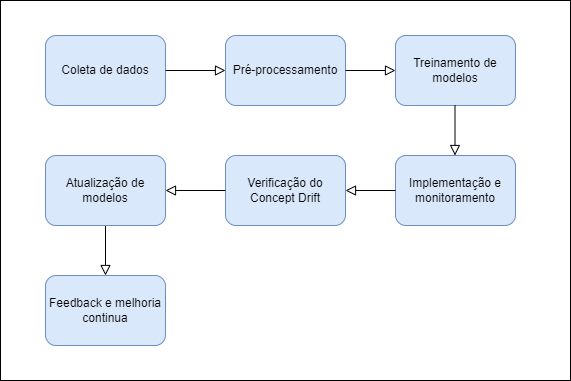

# Tópicos Avançados - MLOps

## Introdução

A ausência de atualização em modelos de aprendizado de máquina é um desafio crucial para manter a eficácia desses sistemas. Um tema importante nesse contexto é o "concept drift", que se refere às mudanças nos padrões dos dados ao longo do tempo. Em outras palavras, o modelo, treinado com um conjunto de dados específico, pode perder sua eficiência ou até mesmo se tornar inadequado à medida que as condições que originaram esses dados se alteram. Este é um desafio significativo em sistemas conversacionais, onde a atualização constante de conhecimento é crucial para manter a relevância e a precisão das respostas. A capacidade de um sistema conversacional de se adaptar a novas informações e contextos é fundamental, especialmente em um mundo em rápida mudança, onde novos dados e eventos surgem constantemente (Prabhu et al., 2020; Chen et al., 2020).

Além disso, a implementação de um sistema que possa aprender continuamente pode melhorar a experiência do usuário, tornando as interações mais naturais e informativas. Logo, a proposta de um sistema conversacional que utilize o aprendizado contínuo é não apenas relevante, mas necessária para a um mundo em que a inteligência artificial se torna cada vez mais presente.

## Solução Proposta

### Diagrama de arquitetura 

A arquitetura proposta para um sistema conversacional com aprendizado contínuo é composta pelos seguintes blocos:

Diagrama de blocos

**Coleta de dados**: Coletar dados de diversas fontes, como logs de conversação, interações de usuários, e até mesmo feedbacks. 

**Pré-processamento de dados**: Limpar e transformar os dados brutos em um formato adequado para análise. Incluindo a remoção de ruídos, vetorização, tratamento de valores ausentes, e normalização dos dados.

**Treinamento de modelos**: Utilizar os dados pré-processados para treinar modelos de machine learning. Realizando a seleção de algoritmos apropriados, ajuste de hiperparâmetros, e avaliação de desempenho dos modelos.

**Implementação e monitoramento**: Implementar os modelos validados em um ambiente de produção e monitorar seu desempenho em tempo real.

**Verificação do Concept Drift**: Utilizar algoritmos específicos para identificar Concept Drift. Levando em consideração variações nos tipos de perguntas, nas expectativas dos usuários e nas áreas de interesse. Além disso, definir métricas de desempenho claras e monitorar continuamente para detectar possíveis declínios, sinalizando a necessidade de atualizações.

**Atualização de modelos**: Atualizar os modelos de machine learning com novos dados e insights. Garantindo que os modelos permaneçam relevantes e precisos ao longo do tempo.

**Feedback e melhoria contínua**: Coletar feedback dos usuários e monitorar o desempenho dos modelos em produção para identificar áreas de melhoria. 

### Requisitos

**Atualização em tempo real**: O sistema deve ser capaz de processar e integrar novas informações rapidamente.

**Retenção de conhecimento**: O sistema deve evitar o esquecimento de informações relevantes já aprendidas.

**Escalabilidade**: A arquitetura deve suportar a adição de novas fontes de dados e informações sem comprometer o desempenho.

**Avaliação de desempenho**: O sistema deve incluir métricas para avaliar a eficácia do aprendizado contínuo.

## Conclusão

A proposta de um sistema conversacional com aprendizado contínuo é uma abordagem promissora para enfrentar os desafios da obsolescência do conhecimento. A implementação dessa solução deve garantir que o sistema possa aprender de forma eficaz sem esquecer informações importantes. A evolução dos sistemas conversacionais para incluir aprendizado contínuo não apenas melhorará a experiência do usuário, mas também abrirá novas possibilidades para a aplicação de inteligência artificial em outras áreas do nosso cotidiano.

## Referências bibliográficas

CHEN, Z.; LIU, B.; PEREIRA, A. *Continual Learning: A Comparative Study on the Effectiveness of Different Approaches*. 2020.

PRABHU, A.; KUMAR, P.; CHAUHAN, D. *A Comprehensive Review on Continual Learning*. 2020.
